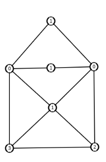
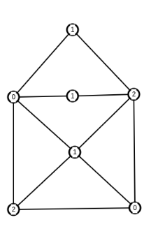
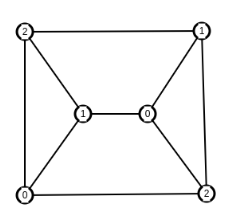
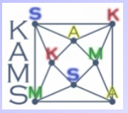

# Kolorowanie grafów
## Słownik pojęć
- Graf SHC (Slightly Hard to Color) - graf, dla którego algorytm kolorujący w zależności do jego implementacji może **(lecz nie musi)** zwrócić nieoptymalne rozwiązanie
- Graf HC (Hard to Color) - graf, dla którerego algorytm kolorujący **na pewno** zwróci nieoptymalne rozwiązanie

## Algorytmy
### LF (Largest First)
Algorytm ten koloruje wierzchołki zachłannie zaczynając od wierzchołka o największym stopniu, a kończąc na tym o najmniejszym.
Jego złozoność obliczeniowa wynosi $O(m+n)$

#### Najmniejszym grafem SHC dla algorytmu LF jest graf $P_6$:

Algorytm LF może pokolorować ten graf w kolejności: $v_2, v_3, v_4 ...$ lub $v_2, v_4, v_3, ...$ natomiast w przypadku kolorowania według według tej drugiej kolejności, algorytm zwróci nieoptymalne rozwiązanie (tj. użyje 3 kolorów zamiast dwóch)

#### Najmniejszym grafem HC dla algorytmu LF jest "koperta":

### SL (Smallest Last)

Algorytm:
- Redukuj graf poprzez wyciąganie z niego wierzchołków o najmniejszych stopniach tak długo, aż graf będzie pusty, zapamiętując przy tym kolejność wyciągania wierzchołków
- koloruj zachłannie wierzchołki wedle tej kolejności

Schemat kolorowania grafu:

Kolejność wyciągania wierzchołków: $v_6, v_5, v_4, v_3, v_2, v_7, v_1$

Algorytm ten optymalnie koloruje grafy Johnsona.

#### Najmniejszym grafem SHC dla algorytmu SL jest pryzma

#### Najmniejszym grafem HC dla algorytmu SL jest pryzmatoid (znany również jako graf Kubaliczny lub logo KAiMSu)

### Funkcja dobroci
Jest to funkcja służąca do ocenienia optymalności rozwiązań danego algorytmu względem wielkości grafu.

$D(n) = max_{|G| = n}\{ \frac{A(G)}{\chi(G)}\}$

Tempo wzrostu funkcji dobroci dla algorytmów LF i SL wynosi $O(n)$. Natomiast rozmiary grafów SHC i HC określają nam, przy jakim n nasz algorytm zaczyna dawać nieoptymalne rozwiązania (tj. $D(n)$ dla $n<|HC|$ wynosi 1)

[Opracowania zadań](https://obrotowy.github.io/paa/zadania.pdf)